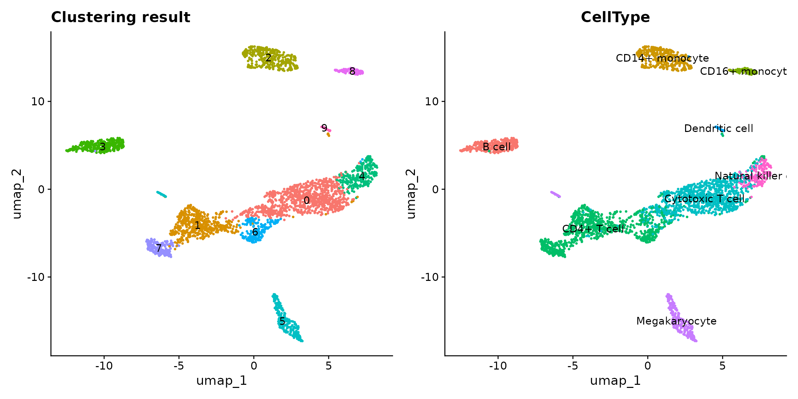
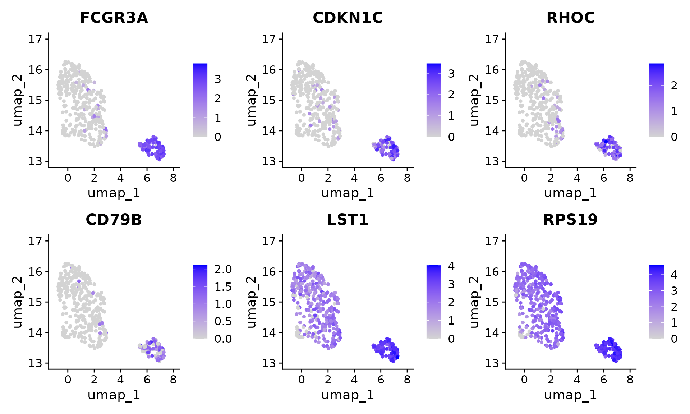
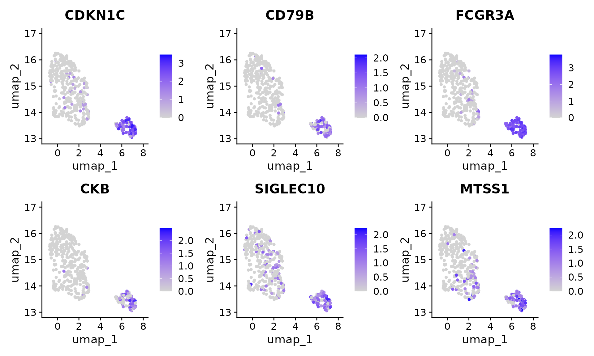
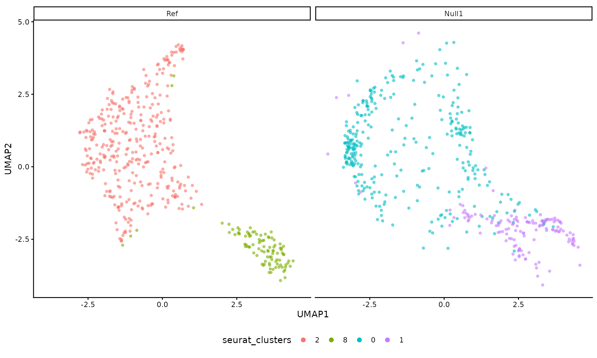
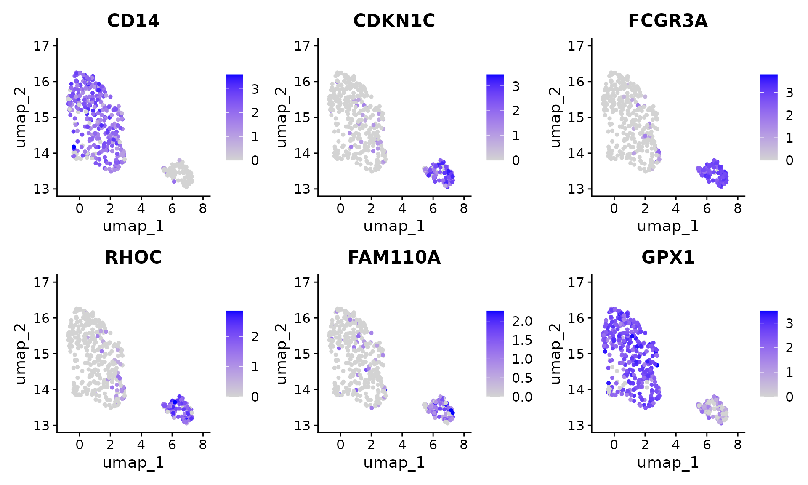
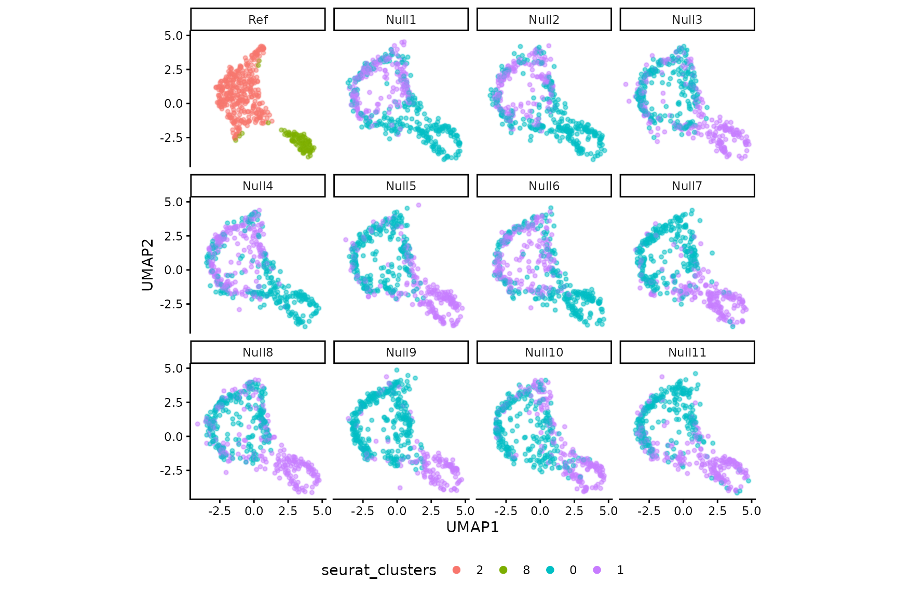

# Perform ClusterDE on a PBMC dataset

## Download data

The PBMC datasets are originally from `SeuratData`. We use one of them
(10x Chromium (v3) from PBMC1 replicate). We filtered out some lowly
epxressed genes to save computational time here.

``` r
# InstallData("pbmcsca")
# data("pbmcsca")
# pbmc <- pbmcsca[, pbmcsca@meta.data$Method=="10x Chromium (v3)" & pbmcsca@meta.data$Experiment == "pbmc1"]
# 
# pbmc <- pbmc[Matrix::rowSums(pbmc@assays$RNA@counts) > 100, ]

# pbmc <- readRDS(url("https://figshare.com/ndownloader/files/41486283"))
data(pbmc, package = "ClusterDE")
```

## Run the regular Seurat pipeline

We perform the default Seurat clustering. Note that in real data
analysis, the cell type label is usually unknown.

``` r
RNGkind("L'Ecuyer-CMRG")
set.seed(123)
pbmc <- Seurat::UpdateSeuratObject(pbmc)
#> Validating object structure
#> Updating object slots
#> Ensuring keys are in the proper structure
#> Warning: Assay RNA changing from Assay to Assay
#> Ensuring keys are in the proper structure
#> Ensuring feature names don't have underscores or pipes
#> Updating slots in RNA
#> Validating object structure for Assay 'RNA'
#> Object representation is consistent with the most current Seurat version
pbmc <- Seurat::NormalizeData(pbmc)
pbmc <- Seurat::FindVariableFeatures(pbmc)
pbmc <- Seurat::ScaleData(pbmc)
#> Centering and scaling data matrix
pbmc <- Seurat::RunPCA(pbmc)
#> PC_ 1 
#> Positive:  IL32, CCL5, TRBC2, TRAC, CD69, CST7, RORA, CTSW, SPOCK2, ITM2A 
#>     GZMM, CD247, TRBC1, C12orf75, IL7R, CD8A, CD2, LDHB, GZMA, CD7 
#>     NKG7, CD6, GZMH, CD8B, BCL11B, PRF1, LYAR, LTB, FGFBP2, TCF7 
#> Negative:  LYZ, FCN1, CLEC7A, CPVL, SERPINA1, SPI1, S100A9, AIF1, NAMPT, CSTA 
#>     CTSS, MAFB, MPEG1, NCF2, VCAN, FGL2, S100A8, TYMP, CST3, LST1 
#>     CYBB, CFD, FCER1G, SLC11A1, TGFBI, GRN, CD14, PSAP, SLC7A7, MS4A6A 
#> PC_ 2 
#> Positive:  RPL10, EEF1A1, TMSB10, RPS2, RPS12, RPL13, RPS18, RPS23, RPLP1, TPT1 
#>     RPS8, IL32, S100A4, PFN1, RPLP0, NKG7, ARL4C, HSPA8, CST7, ZFP36L2 
#>     ANXA1, CTSW, S100A6, LDHA, CORO1A, CD247, GZMA, CALR, S100A10, GZMM 
#> Negative:  NRGN, PF4, SDPR, HIST1H2AC, MAP3K7CL, PPBP, GNG11, GPX1, TUBB1, SPARC 
#>     CLU, PGRMC1, FTH1, RGS18, MARCH2, TREML1, HIST1H3H, AP003068.23, NCOA4, ACRBP 
#>     TAGLN2, PRKAR2B, CD9, CA2, CMTM5, CTTN, MTURN, TMSB4X, HIST1H2BJ, TSC22D1 
#> PC_ 3 
#> Positive:  CD79A, HLA-DQA1, MS4A1, LINC00926, IGHM, BANK1, IGHD, TNFRSF13C, HLA-DQB1, CD74 
#>     IGKC, HLA-DRA, BLK, CD83, CD37, CD22, ADAM28, JUND, NFKBID, HLA-DRB1 
#>     P2RX5, CD79B, VPREB3, IGLC2, FCER2, RPS8, LTB, RPS23, TCOF1, GNG7 
#> Negative:  CCL5, TMSB4X, SRGN, NKG7, ACTB, CST7, GZMH, FGFBP2, CTSW, PRF1 
#>     GZMA, GZMB, C12orf75, S100A4, ANXA1, KLRD1, NRGN, GNLY, GZMM, IL32 
#>     PF4, SDPR, PPBP, MYO1F, CD247, GAPDH, MAP3K7CL, HIST1H2AC, GNG11, TUBB1 
#> PC_ 4 
#> Positive:  FCGR3A, GZMB, FGFBP2, GZMH, NKG7, HLA-DPA1, PRF1, HLA-DPB1, CST7, GNLY 
#>     KLRD1, HLA-DRB1, GZMA, CCL5, SPON2, ADGRG1, CTSW, ZEB2, PRSS23, IFITM2 
#>     CCL4, CD74, KLRF1, RHOC, MTSS1, CDKN1C, CD79B, CEP78, HLA-DQA1, CLIC3 
#> Negative:  IL7R, LEPROTL1, LTB, RCAN3, MAL, LEF1, TCF7, ZFP36L2, CAMK4, VIM 
#>     LDHB, NOSIP, JUNB, SLC2A3, TRABD2A, RGCC, SATB1, TNFAIP3, TMEM123, SOCS3 
#>     AQP3, BCL11B, NELL2, TNFRSF25, CD28, PABPC1, DNAJB1, TRAT1, OXNAD1, TRAC 
#> PC_ 5 
#> Positive:  CDKN1C, HES4, CSF1R, CKB, ZNF703, TCF7L2, CTSL, MS4A7, PAG1, FAM110A 
#>     SIGLEC10, LRRC25, FCGR3A, LTB, RNASET2, CDH23, IL7R, RRAS, LINC01272, IFITM3 
#>     LST1, LILRB2, PILRA, RHOC, SLC2A6, PECAM1, CAMK1, TAGLN, IFI30, BID 
#> Negative:  VCAN, S100A12, S100A8, CD14, CSF3R, ITGAM, CST7, GZMB, MT-CO1, GNLY 
#>     KLRD1, PRF1, MS4A6A, GZMH, FGFBP2, CD93, EGR1, NKG7, S100A9, MT-CO3 
#>     IER3, THBS1, RNASE6, CLEC4E, MGST1, CTSW, SGK1, GZMA, RP11-1143G9.4, CH17-373J23.1
pbmc <- Seurat::FindNeighbors(pbmc)
#> Computing nearest neighbor graph
#> Computing SNN
pbmc <- Seurat::FindClusters(pbmc, resolution = 0.3)
#> Modularity Optimizer version 1.3.0 by Ludo Waltman and Nees Jan van Eck
#> 
#> Number of nodes: 3222
#> Number of edges: 108605
#> 
#> Running Louvain algorithm...
#> Maximum modularity in 10 random starts: 0.9363
#> Number of communities: 10
#> Elapsed time: 0 seconds
pbmc <- Seurat::RunUMAP(pbmc, dims = 1:10)
#> Warning: The default method for RunUMAP has changed from calling Python UMAP via reticulate to the R-native UWOT using the cosine metric
#> To use Python UMAP via reticulate, set umap.method to 'umap-learn' and metric to 'correlation'
#> This message will be shown once per session
#> 20:55:30 UMAP embedding parameters a = 0.9922 b = 1.112
#> 20:55:30 Read 3222 rows and found 10 numeric columns
#> 20:55:30 Using Annoy for neighbor search, n_neighbors = 30
#> 20:55:30 Building Annoy index with metric = cosine, n_trees = 50
#> 0%   10   20   30   40   50   60   70   80   90   100%
#> [----|----|----|----|----|----|----|----|----|----|
#> **************************************************|
#> 20:55:31 Writing NN index file to temp file /tmp/Rtmpc6rjew/file140f8158131bf2
#> 20:55:31 Searching Annoy index using 1 thread, search_k = 3000
#> 20:55:31 Annoy recall = 100%
#> 20:55:32 Commencing smooth kNN distance calibration using 1 thread with target n_neighbors = 30
#> 20:55:33 Initializing from normalized Laplacian + noise (using RSpectra)
#> 20:55:33 Commencing optimization for 500 epochs, with 126446 positive edges
#> 20:55:33 Using rng type: pcg
#> 20:55:36 Optimization finished
p1 <- Seurat::DimPlot(pbmc, reduction = "umap", label = T) +
  ggplot2::ggtitle("Clustering result") +
  Seurat::NoLegend()
p2 <- Seurat::DimPlot(pbmc, reduction = "umap", group.by = "CellType", label = T) +
  Seurat::NoLegend()
p1 + p2
```



In this vignette, we are interested in cluster 2 vs 8, which
approximately represent CD14+/CD16+ monocytes. Please note that
ClusterDE is designed for 1 vs 1 comparison. Therefore, users may (1)
choose the two interested clusters manually based on their knowledge or
(2) use the two locally closest clusters from computation (e.g.,
`BuildClusterTree` in `Seurat`).

``` r
library(Seurat)
#> Loading required package: SeuratObject
#> Loading required package: sp
#> 
#> Attaching package: 'SeuratObject'
#> The following objects are masked from 'package:base':
#> 
#>     intersect, t
pbmc <- BuildClusterTree(pbmc)
PlotClusterTree(pbmc)
```


We perform the DE test between cluster 2 and 8. We subset the cluster 2
and 8 (`pbmc_sub`).

``` r
pbmc_sub <- subset(x = pbmc, idents = c(2, 8))
# Remove genes with zero variance
non_zero_genes <- apply(Seurat::GetAssayData(pbmc_sub, layer = "counts"), 1, var) != 0
pbmc_sub <- pbmc_sub[non_zero_genes,]

original_markers <- FindMarkers(
  pbmc_sub,
  ident.1 = 2,
  ident.2 = 8,
  min.pct = 0,
  logfc.threshold = 0
)
```

## Find DEGs using ClusterDE

We can use `findMarkers()` to perform null-calibrated post-clustering
differential expression. The result table is sorted by contrast scores.

``` r
res <- ClusterDE::findMarkers(pbmc_sub, ident.1 = 2, ident.2 = 8)
#> 107 genes have no more than 2 non-zero values; ignore fitting and return all 0s.
#> 64.7% of genes are used in correlation modelling.
#> 0/1: Modularity Optimizer version 1.3.0 by Ludo Waltman and Nees Jan van Eck
#> 0/1: 
#> 0/1: Number of nodes: 453
#> 0/1: Number of edges: 18845
#> 0/1: 
#> 0/1: Running Louvain algorithm...
#> 0/1: Maximum modularity in 10 random starts: 0.7221
#> 0/1: Number of communities: 2
#> 0/1: Elapsed time: 0 seconds
#> 0/1: Normalizing layer: counts
#> 0/1: Finding variable features for layer counts
#> 0/1: Centering and scaling data matrix
#> 0/1: PC_ 1 
#> Positive:  RPS19, PFN1, LST1, YBX1, AIF1, IFITM3, RPL8, RPS27, FTL, FCER1G 
#>     RPL41, B2M, RNASET2, RPL10, FTH1, NACA, COTL1, HLA-C, FCGR3A, EEF1A1 
#>     HLA-B, RPL15, RPL19, TYROBP, RPL7A, CORO1A, TMSB10, SOD1, RPL11, RHOC 
#> Negative:  VCAN, S100A8, S100A9, FOS, LYZ, CD14, SLC2A3, S100A12, CSF3R, GPX1 
#>     MS4A6A, IRF2BP2, FOSB, ITGAM, RGS2, THBS1, CD36, PPIF, DUSP6, ZFP36L1 
#>     IER3, KLF10, CD93, NCF1, SELL, NFKBIA, SGK1, CEBPD, LUCAT1, CYP1B1 
#> PC_ 2 
#> Positive:  TPT1, RPS13, RPS3A, RPL18A, S100A10, RPS18, GAPDH, RPS23, RPS8, HLA-DRA 
#>     RPLP0, RPL3, RPS6, VIM, FCN1, BTF3, RPS2, LYZ, GPX1, RPL6 
#>     GRN, RPL37A, EEF1A1, LGALS3, RPS4X, RPL21, RPL30, RPL23A, RPL15, RPS15 
#> Negative:  CDKN1C, FCGR3A, CD79B, MTSS1, CTSL, ADA, RNF144B, RHOC, CKB, HES4 
#>     PECAM1, PIK3CG, CSF1R, SLC2A6, POU2F2, RRAS, SSH2, IFITM2, C3AR1, MS4A7 
#>     FAM126A, TSPAN32, PTPN6, TCF7L2, PKN1, KLF2, SAT1, DRAP1, SOD1, SFMBT2 
#> PC_ 3 
#> Positive:  HMGB2, IRS2, CLEC2D, S100A12, ZFP36L2, LINC00657, HSPA8, QPCT, TNFSF10, PPP2R5E 
#>     BST1, RPS3, NSMCE3, VCAN, RNF144B, JUN, RBP7, CES1, RAB27A, SOX4 
#>     RPS8, RGS2, RPL23A, PLBD1, S100A8, YPEL3, LUC7L3, RPL6, LRMP, RPL34 
#> Negative:  HLA-DPA1, HLA-DRA, HLA-DPB1, EMP3, APOBEC3A, RGCC, HLA-DRB1, MARCKS, DUSP6, INSIG1 
#>     C5AR1, CD74, CTNNB1, HMOX1, HIC1, BHLHE40, XYLT1, CALM2, S100A11, MAFB 
#>     TLE3, MARCKSL1, FUCA1, HLA-DQB1, EZR, FCER1G, PPIF, RASGEF1B, CST3, SMAD7 
#> PC_ 4 
#> Positive:  WDR74, SERPINA1, ACTB, S100A4, FTL, TMSB4X, BCL2A1, FTH1, S100A8, GAPDH 
#>     RGS2, S100A9, AP1S2, FOS, S100A12, TYROBP, COTL1, CCDC109B, AIF1, JUNB 
#>     S100A11, H1FX, EGR1, CD14, LYZ, SERF2, RBP7, FCER1G, BASP1, NFKBIZ 
#> Negative:  ARL4C, DNAJB14, MAP3K8, IL2RG, DDIT4, PNPT1, HLA-DQB1, ANKLE2, APOL6, NSMCE3 
#>     SMAD7, RBM17, HLA-DPB1, MRE11A, MPRIP, CNIH1, TNFSF12, DDX6, ZCCHC11, NKG7 
#>     C1orf56, DDHD1, HLA-DPA1, KMT2A, RUNX3, ISG20L2, MGAT4A, KCNQ1, RP11-796E2.4, ARHGAP15 
#> PC_ 5 
#> Positive:  HLA-DMA, FAM26F, MRPS36, CD74, HLA-DRB1, RGS19, HLA-DQB1, HLA-DMB, CAMK1, MT2A 
#>     HIGD2A, SERTAD3, CHCHD10, PPCDC, FAM49A, LILRA5, NABP1, CPVL, MAT2A, KYNU 
#>     PID1, TEX261, CST3, IRF7, SNIP1, RPS2, STK26, DNAJC18, CAT, GALNS 
#> Negative:  CD63, ZBTB7A, LINC00969, LINC00657, SSBP4, MGAT4A, ZNF654, VIM, ITGAL, ID2 
#>     VEGFA, FBXO7, PRPF38B, CEBPB, YY1, CSTB, SNRPA1, HSD17B4, PAG1, PDP1 
#>     TFRC, NPEPPS, COMMD2, PLEC, RAB22A, ZDHHC17, BRWD1, DNASE2, GABARAPL1, TLR2
#> 0/1: Computing nearest neighbor graph
#> 0/1: Computing SNN
head(res)
#> # A tibble: 6 × 3
#>   gene        cs record
#>   <chr>    <dbl>  <dbl>
#> 1 CDKN1C    39.9      1
#> 2 CD79B     38.6      1
#> 3 FCGR3A    33.8      1
#> 4 CKB       32.3      1
#> 5 SIGLEC10  24.4      1
#> 6 MTSS1     23.8      1
```

To compare the result from the naive Seurat pipeline and ClusterDE, we
first visualize the top 6 DE genes from Seurat. Genes *LST1* and *RPS19*
are both highly expressed in two clusters. In addition, *RPS19* is
reported as a stable housekeeping genes in several studies. Note that it
does not mean the expression levels of *LST1* and *RPS19* are the same
between the two cell types. It means that they are not good cell type
markers. Philosophically speaking, it means that **conditional on the
two clusters are obtained by clustering algorithm, LST1 and RPS19 are
less likely to be the cell type markers between the two cell types**.

``` r
FeaturePlot(pbmc[, pbmc$seurat_clusters %in% c(2, 8)], features = c(rownames(original_markers)[1:6]), ncol = 3)
```

 In contrast,
the genes from ClusterDE do not have *LST1* and *RPS19* anymore.

``` r
FeaturePlot(pbmc[, pbmc$seurat_clusters %in% c(2, 8)], features = c(res$gene[1:6]), ncol = 3)
```



## Customize null data generation

Here we show how ClusterDE generates and calculates the synthetic null
data p-values. The synthetic null data is first generated based on the
target data (real subset data, pbmc\_sub, which contains the two
clusters you are interested in). You can increase the number of cores
(CPUs) to speed it up.

``` r
null_data <- ClusterDE::constructNull(pbmc_sub, nCores = 1)
#> 107 genes have no more than 2 non-zero values; ignore fitting and return all 0s.
#> 64.7% of genes are used in correlation modelling.
```

Next we perform the same preprocess pipeline for the null data as the
target data, which is wrapped in `calcNullPval()`. This uses Louvain
clustering in Seurat to adjust resolution until two clusters are found.

``` r
null_pval <- ClusterDE::calcNullPval(null_data)
#> 0/1: Modularity Optimizer version 1.3.0 by Ludo Waltman and Nees Jan van Eck
#> 0/1: 
#> 0/1: Number of nodes: 453
#> 0/1: Number of edges: 18061
#> 0/1: 
#> 0/1: Running Louvain algorithm...
#> 0/1: Maximum modularity in 10 random starts: 0.7460
#> 0/1: Number of communities: 2
#> 0/1: Elapsed time: 0 seconds
#> 0/1: Normalizing layer: counts
#> 0/1: Finding variable features for layer counts
#> 0/1: Centering and scaling data matrix
#> 0/1: PC_ 1 
#> Positive:  RPS19, AIF1, YBX1, COTL1, FTL, LST1, NACA, PFN1, FTH1, RPL8 
#>     HLA-C, RPS27, FCER1G, RPL41, RPL10, TMSB4X, HLA-B, IFITM3, B2M, ARPC3 
#>     RPL11, RPL19, TMSB10, IFITM2, EEF1A1, RNASET2, ACTB, RPL15, FCGR3A, CFD 
#> Negative:  S100A8, VCAN, S100A9, S100A12, CD14, CSF3R, LYZ, FOS, SLC2A3, NCF1 
#>     CYP1B1, MS4A6A, SELL, PTPRE, CCR1, RGS2, SGK1, IRF2BP2, GPX1, HIF1A 
#>     RNASE6, IER3, DUSP6, CD36, MGST1, JARID2, CRTAP, PPIF, STAB1, FOSB 
#> PC_ 2 
#> Positive:  MALAT1, CDKN1C, KLF2, FCGR3A, PECAM1, FAM110A, SLC2A6, POU2F2, CD79B, MTSS1 
#>     TCF7L2, RRAS, SIGLEC10, PAG1, CAT, HES4, SLC44A2, RHOC, IFITM2, SNX9 
#>     MS4A7, YPEL2, CYTIP, PKN1, LYST, SFMBT2, ADA, PIK3CG, LYL1, WARS 
#> Negative:  TPT1, RPS13, GAPDH, VIM, RPS3A, RPL3, LYZ, RPS23, RPL18A, RPS18 
#>     RPL28, RPS14, RPS2, HLA-DRA, RPS12, GPX1, RPS6, RPS8, EEF1A1, RPS15 
#>     RPL37A, RPL5, RPL23A, FCN1, RPL30, S100A9, RPL10A, RPL37, S100A10, RPL11 
#> PC_ 3 
#> Positive:  HLA-DRA, HLA-DRB1, HLA-DPB1, HLA-DQB1, EMP3, HLA-DPA1, MARCKS, DUSP6, CD74, APOBEC3A 
#>     CPVL, CST3, MARCKSL1, IFI30, HLA-DMB, ISG15, NAAA, CDKN1A, CD300E, GPX1 
#>     BHLHE40, HIC1, LGALS3, IFITM3, FUCA1, SRC, LIPA, HLA-DMA, EZR, HMOX1 
#> Negative:  HMGB2, IRS2, RGS2, RPL30, BTG1, RPS15A, PIK3IP1, ZFP36L2, RPS3A, HSPA8 
#>     RPS27, EGR1, SELL, S100A12, RPS3, PLBD1, JUN, LEPROTL1, C12orf57, SOD2 
#>     RPSA, EFCAB2, RPL23A, SLU7, VCAN, ALOX5AP, RPL5, RPS6, TNFSF10, RPS4X 
#> PC_ 4 
#> Positive:  RPS14, ARPC1B, ATF3, RPL5, DSTYK, KRI1, C12orf76, RPL37, RPL28, RPL19 
#>     HIF1AN, DAPP1, TRRAP, CASP7, DCTPP1, AIF1, RPL29, RPS2, IL6R, USP1 
#>     RPL10, KIF20B, TMEM18, AACS, RPL41, C5AR1, RPS13, ZBTB14, RPL8, RPS19 
#> Negative:  CALM1, SNRK, LYAR, SSBP3, MALAT1, PRPF38B, DDX6, ARL4C, NKG7, ITGB1 
#>     TMEM2, KLF10, SRSF7, IMPAD1, TPST2, ABCC3, DNMT1, LINC00969, LINC-PINT, DDIT4 
#>     JARID2, MAP3K2, HBEGF, ASH1L, CYTIP, MAP3K8, APOBEC3A, INSIG1, EML4, DDHD1 
#> PC_ 5 
#> Positive:  UHMK1, CTB-50L17.10, ANKRD9, CEP44, LPAR6, PPM1K, VPS41, TANGO2, C6orf1, INIP 
#>     MARCH9, TIMM23B, BBC3, AGPAT5, TAGLN2, CITED2, USP1, NDUFAF4, TMEM107, CLN3 
#>     PSMB9, RPL14, BRI3BP, PRPF38B, BLMH, UBE2D4, LYRM5, SMU1, C16orf74, LINC00877 
#> Negative:  SLC2A3, ACTB, WDR11, PLAUR, WDFY2, ICAM3, S100A8, ACTG1, PLBD1, S100A9 
#>     UNC119, MAFG, WDR62, RBAK, VPS13A, C19orf38, CUX1, S100A12, SRGAP2B, SELL 
#>     BAX, MRPL2, VIM, CLEC4E, EMP3, RAB34, PTGER2, GAPDH, ACSL4, HCST
#> 0/1: Computing nearest neighbor graph
#> 0/1: Computing SNN
```

You can use `dimPlot()` to compare the reference (real) dataset and the
synthetic null datasets generated by ClusterDE.

``` r
ClusterDE::dimPlot(pbmc_sub, null_pval$data)
#> Warning: replacing previous import 'S4Arrays::makeNindexFromArrayViewport' by
#> 'DelayedArray::makeNindexFromArrayViewport' when loading 'SummarizedExperiment'
#> Registered S3 method overwritten by 'scDesign3':
#>   method         from  
#>   predict.gamlss gamlss
#> Found more than one class "dist" in cache; using the first, from namespace 'spam'
#> Also defined by 'BiocGenerics'
#> Found more than one class "dist" in cache; using the first, from namespace 'spam'
#> Also defined by 'BiocGenerics'
```



We extract the p-values from both original data and synthetic null data,
then use ClusterDE to “compare” them.

``` r
original_pval <- original_markers$p_val
names(original_pval) <- rownames(original_markers)
res <- ClusterDE::callDE(original_pval, null_pval$p)
```

The result table is the list of DEGs ranked by contrast scores, which is
also used as the output of `findMarkers()`.

``` r
head(res)
#> # A tibble: 6 × 3
#>   gene      cs record
#>   <chr>  <dbl>  <dbl>
#> 1 CDKN1C  33.2      1
#> 2 CD79B   31.4      1
#> 3 FCGR3A  29.7      1
#> 4 HES4    24.1      1
#> 5 PLD4    23.6      1
#> 6 CYFIP2  22.6      1
```

## PCA approximation for faster null data generation

For a more robust DEG detection, ClusterDE allows generating **multiple
null data replicates**. By increasing number of `nRep` in
`findMarkers()`, you can create several synthetic null datasets and
compare all of them against the original DE markers. When generating
many null data replicates (`nRep`) for DEG analysis, null data
simulation can become time-consuming. ClusterDE provides a **PCA-based
approximation** to speed up this process. By setting `flavour` to “pca”
and increasing number of threads (`nCores`) in `findMarkers()`, the null
datasets are generated faster while still preserving robustness.

``` r
res <- ClusterDE::findMarkers(
  pbmc_sub,
  ident.1 = 2,
  ident.2 = 8,
  flavour = "pca",
  nRep = 40,
  nCores = 8
)
```

The `record` column counts the frequency with which each gene is
identified as a DEG across null data replicates.

  - A higher `record` value indicates that the gene is consistently
    called differentially expressed across multiple simulated null
    datasets.
  - This metric helps assess the **stability and reproducibility** of DE
    calls.

<!-- end list -->

``` r
head(res)
#> # A tibble: 6 × 3
#>   gene      cs record
#>   <chr>  <dbl>  <dbl>
#> 1 CDKN1C  27.9  0.75 
#> 2 FCGR3A  27.0  0.75 
#> 3 CD79B   25.9  0.625
#> 4 RHOC    23.0  0.75 
#> 5 CKB     21.3  0.725
#> 6 TCF7L2  18.8  0.825
```

We can also visualize the genes found by ClusterDE with multiple
replicates and PCA approximation.

``` r
FeaturePlot(pbmc[, pbmc$seurat_clusters %in% c(2, 8)], features = c(res$gene[1:6]), ncol = 3)
```



To explicitly construct null data using PCA approximation, you can
specify `usePca = T` and adjust number of PCs by changing `nPcs` in
`constructNull()`.

``` r
null_data <- ClusterDE::constructNull(pbmc_sub, usePca = T, nCores = 8, nRep = 40, nPcs = 200)
#> Contruct PCA
#> Construct scDesign3 data
#> Fit marginal
#> Fit copula
#> Generate null data of 40 replicates
```

The returned `null_data` will contain a list of all replicates. Then we
can use `calcNullPval()` to preprocess and calculate gene p-values for
each replicate. Note that if PCA approximation is used, the simulated
null data is not a true count matrix, so normalization should be
skipped, and highly variable genes should be provided from real
reference data.

``` r
null_pval <- ClusterDE::calcNullPval(null_data, normalize = F, hvg = Seurat::VariableFeatures(pbmc_sub), nCores = 8)
```

Here we show part of the simulated null replicates in the same UMAP
space as real data.

``` r
ClusterDE::dimPlot(pbmc_sub, null_pval$data[1:11])
#> Found more than one class "dist" in cache; using the first, from namespace 'spam'
#> Also defined by 'BiocGenerics'
#> Found more than one class "dist" in cache; using the first, from namespace 'spam'
#> Also defined by 'BiocGenerics'
#> Found more than one class "dist" in cache; using the first, from namespace 'spam'
#> Also defined by 'BiocGenerics'
#> Found more than one class "dist" in cache; using the first, from namespace 'spam'
#> Also defined by 'BiocGenerics'
#> Found more than one class "dist" in cache; using the first, from namespace 'spam'
#> Also defined by 'BiocGenerics'
#> Found more than one class "dist" in cache; using the first, from namespace 'spam'
#> Also defined by 'BiocGenerics'
#> Found more than one class "dist" in cache; using the first, from namespace 'spam'
#> Also defined by 'BiocGenerics'
#> Found more than one class "dist" in cache; using the first, from namespace 'spam'
#> Also defined by 'BiocGenerics'
#> Found more than one class "dist" in cache; using the first, from namespace 'spam'
#> Also defined by 'BiocGenerics'
#> Found more than one class "dist" in cache; using the first, from namespace 'spam'
#> Also defined by 'BiocGenerics'
#> Found more than one class "dist" in cache; using the first, from namespace 'spam'
#> Also defined by 'BiocGenerics'
#> Found more than one class "dist" in cache; using the first, from namespace 'spam'
#> Also defined by 'BiocGenerics'
```



## Session information

``` r
sessionInfo()
#> R version 4.3.1 (2023-06-16)
#> Platform: x86_64-pc-linux-gnu (64-bit)
#> Running under: Red Hat Enterprise Linux 8.10 (Ootpa)
#> 
#> Matrix products: default
#> BLAS:   /sw/pkgs/arc/stacks/gcc/10.3.0/R/4.3.1/lib64/R/lib/libRblas.so 
#> LAPACK: /sw/pkgs/arc/stacks/gcc/10.3.0/R/4.3.1/lib64/R/lib/libRlapack.so;  LAPACK version 3.11.0
#> 
#> Random number generation:
#>  RNG:     L'Ecuyer-CMRG 
#>  Normal:  Inversion 
#>  Sample:  Rejection 
#>  
#> locale:
#>  [1] LC_CTYPE=en_US.UTF-8       LC_NUMERIC=C              
#>  [3] LC_TIME=en_US.UTF-8        LC_COLLATE=en_US.UTF-8    
#>  [5] LC_MONETARY=en_US.UTF-8    LC_MESSAGES=en_US.UTF-8   
#>  [7] LC_PAPER=en_US.UTF-8       LC_NAME=C                 
#>  [9] LC_ADDRESS=C               LC_TELEPHONE=C            
#> [11] LC_MEASUREMENT=en_US.UTF-8 LC_IDENTIFICATION=C       
#> 
#> time zone: America/Detroit
#> tzcode source: system (glibc)
#> 
#> attached base packages:
#> [1] stats     graphics  grDevices utils     datasets  methods   base     
#> 
#> other attached packages:
#> [1] Seurat_5.3.1       SeuratObject_5.2.0 sp_2.2-0           future_1.67.0     
#> [5] BiocStyle_2.30.0  
#> 
#> loaded via a namespace (and not attached):
#>   [1] RcppAnnoy_0.0.22            splines_4.3.1              
#>   [3] later_1.4.4                 bitops_1.0-9               
#>   [5] tibble_3.3.0                polyclip_1.10-7            
#>   [7] gamlss.data_6.0-7           fastDummies_1.7.5          
#>   [9] lifecycle_1.0.4             globals_0.18.0             
#>  [11] lattice_0.21-8              MASS_7.3-60                
#>  [13] backports_1.5.0             magrittr_2.0.4             
#>  [15] limma_3.58.1                plotly_4.11.0              
#>  [17] sass_0.4.10                 rmarkdown_2.30             
#>  [19] jquerylib_0.1.4             yaml_2.3.10                
#>  [21] httpuv_1.6.16               otel_0.2.0                 
#>  [23] sctransform_0.4.2           askpass_1.2.1              
#>  [25] spam_2.11-1                 spatstat.sparse_3.1-0      
#>  [27] reticulate_1.44.0           cowplot_1.2.0              
#>  [29] pbapply_1.7-4               RColorBrewer_1.1-3         
#>  [31] zlibbioc_1.48.2             abind_1.4-8                
#>  [33] Rtsne_0.17                  GenomicRanges_1.54.1       
#>  [35] purrr_1.1.0                 presto_1.0.0               
#>  [37] BiocGenerics_0.48.1         kde1d_1.1.1                
#>  [39] RCurl_1.98-1.17             GenomeInfoDbData_1.2.11    
#>  [41] IRanges_2.36.0              S4Vectors_0.40.2           
#>  [43] ggrepel_0.9.6               irlba_2.3.5.1              
#>  [45] listenv_0.9.1               spatstat.utils_3.2-0       
#>  [47] umap_0.2.10.0               goftest_1.2-3              
#>  [49] RSpectra_0.16-2             spatstat.random_3.4-2      
#>  [51] fitdistrplus_1.2-4          parallelly_1.45.1          
#>  [53] pkgdown_2.2.0               DelayedArray_0.28.0        
#>  [55] codetools_0.2-19            tidyselect_1.2.1           
#>  [57] farver_2.1.2                randtoolbox_2.0.5          
#>  [59] matrixStats_1.5.0           stats4_4.3.1               
#>  [61] spatstat.explore_3.5-3      jsonlite_2.0.0             
#>  [63] progressr_0.17.0            ggridges_0.5.7             
#>  [65] survival_3.5-5              systemfonts_1.3.1          
#>  [67] bettermc_1.2.2.9000         tools_4.3.1                
#>  [69] ragg_1.5.0                  ica_1.0-3                  
#>  [71] Rcpp_1.1.0                  glue_1.8.0                 
#>  [73] SparseArray_1.2.4           gridExtra_2.3              
#>  [75] xfun_0.53                   mvnfast_0.2.8              
#>  [77] MatrixGenerics_1.14.0       scDesign3_1.7.6            
#>  [79] GenomeInfoDb_1.38.8         dplyr_1.1.4                
#>  [81] withr_3.0.2                 BiocManager_1.30.26        
#>  [83] fastmap_1.2.0               openssl_2.3.4              
#>  [85] digest_0.6.37               gamlss_5.5-0               
#>  [87] R6_2.6.1                    mime_0.13                  
#>  [89] textshaping_1.0.4           scattermore_1.2            
#>  [91] tensor_1.5.1                spatstat.data_3.1-9        
#>  [93] utf8_1.2.6                  tidyr_1.3.1                
#>  [95] generics_0.1.4              data.table_1.17.8          
#>  [97] S4Arrays_1.2.1              httr_1.4.7                 
#>  [99] htmlwidgets_1.6.4           rngWELL_0.10-10            
#> [101] uwot_0.2.3                  pkgconfig_2.0.3            
#> [103] gtable_0.3.6                lmtest_0.9-40              
#> [105] S7_0.2.0                    SingleCellExperiment_1.24.0
#> [107] XVector_0.42.0              htmltools_0.5.8.1          
#> [109] dotCall64_1.2               bookdown_0.45              
#> [111] Biobase_2.62.0              scales_1.4.0               
#> [113] png_0.1-8                   spatstat.univar_3.1-4      
#> [115] knitr_1.50                  reshape2_1.4.4             
#> [117] checkmate_2.3.3             nlme_3.1-162               
#> [119] cachem_1.1.0                zoo_1.8-14                 
#> [121] stringr_1.5.2               KernSmooth_2.23-21         
#> [123] parallel_4.3.1              miniUI_0.1.2               
#> [125] desc_1.4.3                  pillar_1.11.1              
#> [127] grid_4.3.1                  vctrs_0.6.5                
#> [129] RANN_2.6.2                  promises_1.4.0             
#> [131] xtable_1.8-4                cluster_2.1.4              
#> [133] gamlss.dist_6.1-1           evaluate_1.0.5             
#> [135] cli_3.6.5                   compiler_4.3.1             
#> [137] crayon_1.5.3                rlang_1.1.6                
#> [139] future.apply_1.20.0         labeling_0.4.3             
#> [141] mclust_6.1.1                plyr_1.8.9                 
#> [143] fs_1.6.6                    stringi_1.8.7              
#> [145] viridisLite_0.4.2           deldir_2.0-4               
#> [147] assertthat_0.2.1            rvinecopulib_0.7.3.1.0     
#> [149] lazyeval_0.2.2              coop_0.6-3                 
#> [151] spatstat.geom_3.6-0         Matrix_1.6-5               
#> [153] RcppHNSW_0.6.0              patchwork_1.3.2            
#> [155] ggplot2_4.0.0               statmod_1.5.1              
#> [157] shiny_1.11.1                SummarizedExperiment_1.32.0
#> [159] ROCR_1.0-11                 igraph_2.2.1               
#> [161] ClusterDE_0.99.3            bslib_0.9.0                
#> [163] ape_5.8-1
```
