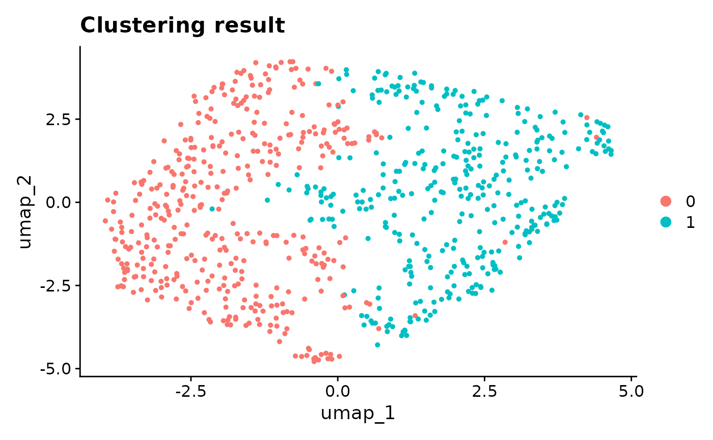
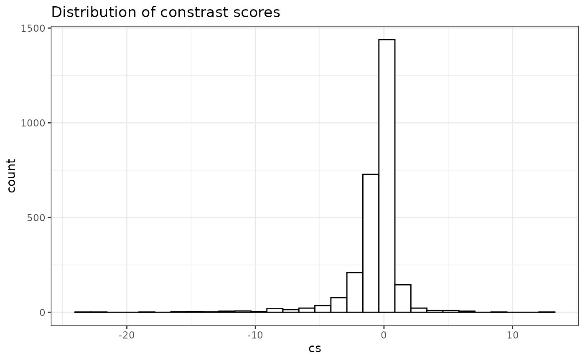

# Perform ClusterDE on a cell line dataset

## Download data

We download the cell line data set H2228. The original data is from
[Tian et al., Nature
Methods 2019](https://github.com/LuyiTian/sc_mixology) as the gold
standard for benchmarking the accuracy of clustering. Since the data is
from the pure cell line, it should not have cell types, and, of course,
between cell type DE genes. **Note**: it does not mean that there are no
variations within one cell line; of course there are, e.g., cell cycle,
total UMI, etc. However, these variations do not represent **discrete
cell groups**, and essentially it means you should not use your obtained
clusters to explain the variation.

``` r
# sce <- readRDS(url("https://figshare.com/ndownloader/files/41395260"))
# cellline <- Seurat::as.Seurat(sce)
data(cellline, package = "ClusterDE")
```

## Run the regular Seurat pipeline

We perform the default Seurat clustering. Please note that ClusterDE is
designed for 1 vs 1 comparison; therefore, we set the resolution as 0.2
here to obtain two clusters for illustration purpose.

``` r
RNGkind("L'Ecuyer-CMRG")
set.seed(123)
cellline <- Seurat::UpdateSeuratObject(cellline)
#> Validating object structure
#> Updating object slots
#> Ensuring keys are in the proper structure
#> Updating matrix keys for DimReduc 'PCA'
#> Updating matrix keys for DimReduc 'UMAP'
#> Ensuring keys are in the proper structure
#> Ensuring feature names don't have underscores or pipes
#> Updating slots in originalexp
#> Updating slots in PCA
#> Updating slots in UMAP
#> Setting UMAP DimReduc to global
#> Validating object structure for Assay 'originalexp'
#> Validating object structure for DimReduc 'PCA'
#> Validating object structure for DimReduc 'UMAP'
#> Object representation is consistent with the most current Seurat version
cellline <- Seurat::NormalizeData(cellline)
cellline <- Seurat::FindVariableFeatures(cellline)
cellline <- Seurat::ScaleData(cellline)
#> Centering and scaling data matrix
cellline <- Seurat::RunPCA(cellline)
#> PC_ 1 
#> Positive:  RPS14, RPL18AP3, RPL36, RPS23, RPL28, LRRC75A-AS1, AC079250.1, FTH1, ZFAS1, EEF2 
#>     RPL7P9, RPL13A, RPS3AP26, EEF1A1P13, RPS16, RPS23P8, RPL13AP5, RPL29, FTH1P10, RPL13AP25 
#>     SNHG5, FTH1P8, RPL4, RPS3AP6, AC064799.1, C6orf48, FTH1P7, C1orf56, RPL7AP6, TMSB4X 
#> Negative:  PSMB2, PSMA7, U2AF1, NUDC, RBM8A, CALM1, BUB3, CLIC1, U2AF1L5, XRCC5 
#>     VPS29, RBM8B, CACYBP, RPA3, SSBP1, PSMC5, MRPL47, PSMD8, BRIX1, CNIH4 
#>     PCMT1, PSMD13, CYC1, PRDX2, SEPT7, S100A11, VDAC3, PSME2P2, ZWINT, HMGB1 
#> PC_ 2 
#> Positive:  NACA, RPL7AP6, SKP1, UBA52, BTF3, SSR2, RPL7A, ARPC3, RPL9P9, PPIA 
#>     PSMD4, EIF1, RPL10, LGALS3BP, RPL10P16, SNRPB2, RPL10P9, S100A11, PPIB, ANXA5 
#>     EEF2, PSME1, SSBP1, SSR4, RPL7P9, COPE, BSG, MGST1, VPS28, COPS6 
#> Negative:  SIVA1, HNRNPAB, RPL39L, DEK, CDCA5, TMPO, FAM111A, ASF1B, CENPK, ESCO2 
#>     BRCA1, H2AFV, RAD51AP1, MT-RNR2, ORC6, CENPX, SNRNP25, FBXO5, RRM1, DIAPH3 
#>     USP1, CDCA4, TMEM106C, PGP, LSM4, C21orf58, CENPN, BRI3BP, SGO1, CHAF1A 
#> PC_ 3 
#> Positive:  RPL13AP5, RPL13AP25, AC024293.1, RPL29, RPSAP19, RPS5, RPL18, RPS3AP26, RPS3AP6, RPL15 
#>     RPL28, DRAP1, RPS11, RPL9P9, RPL13AP7, RPS19, DCBLD2, FXYD5, FEN1, SLBP 
#>     RPS15, COTL1, RPSA, FLNA, RPL7AP6, RPL36, C1orf21, CPA4, ORC6, RPS16 
#> Negative:  SMIM22, TSPAN13, ST14, PERP, CRB3, MT-CO1, SERINC2, ATP1B1, CDH1, F11R 
#>     B2M, MT-RNR2, SPINT1, NMB, PLA2G16, SPDEF, CD55, ADGRF1, TSPAN1, LIMA1 
#>     ERBB3, ERO1A, ASS1, CDA, ALCAM, SYNGR2, MT-CO2, CDH3, C3, LSR 
#> PC_ 4 
#> Positive:  IFNGR1, NAMPT, NAP1L1, CPD, LMAN1, CALR, ITGA2, NAMPTP1, ITM2B, RRM1 
#>     C3, RHOBTB3, CTHRC1, EEF2, HSD17B11, C1S, IFI16, SMC2, CPE, EPHX1 
#>     DST, HLA-DMB, NUCB2, MT-ND6, TMEM45A, BRCA1, CDK5RAP2, HINT1, C1R, FAM111A 
#> Negative:  S100A16, TMA7, TIMM8B, PFN1, SLIRP, GPX1, LAMC2, POLR2L, MRPL52, RPS19 
#>     CDH1, TOMM40, ATP5MD, HSPE1, NAA10, GPX1P1, RPS16, MRPL12, MCRIP2, PDCD5 
#>     RPL18, PLEC, S100A13, RPL36AL, LAD1, MGLL, BOLA2B, MISP, MRPL36, SEC61G 
#> PC_ 5 
#> Positive:  HINT1, COX5B, TXN, SOD1, NDUFA4, NDUFS6, ATP5PO, ATP5MC3, S100A10, ATP6V0E1 
#>     CYB5A, SLIRP, NDUFB4, ATP5MC1, HSPE1, TXNP6, POMP, POLR2L, RPS14, HSPE1P4 
#>     RPS15, CBR1, NDUFB3, HSPE1P3, ATP5PD, COX7B, ADGRF1, PSMB9, AC079250.1, NDUFAB1 
#> Negative:  BTG1, PPP1R15A, EIF1, JUN, CEBPG, H3F3B, TMEM132A, C6orf48, HIST2H4B, SGK1 
#>     KPNA4, PMEPA1, KLF6, CDKN1A, WARS, PEA15, GARS, MAP1LC3B, SNHG12, SERTAD1 
#>     LAMC2, EPB41L4A-AS1, NAP1L1, SNHG5, KLF10, SLC7A5, KIF5B, ATP2B1, EIF5, ABL2
#> Warning: Key 'PC_' taken, using 'pca_' instead
cellline <- Seurat::FindNeighbors(cellline)
#> Computing nearest neighbor graph
#> Computing SNN
cellline <- Seurat::FindClusters(cellline, resolution = 0.2)
#> Modularity Optimizer version 1.3.0 by Ludo Waltman and Nees Jan van Eck
#> 
#> Number of nodes: 758
#> Number of edges: 24895
#> 
#> Running Louvain algorithm...
#> Maximum modularity in 10 random starts: 0.8257
#> Number of communities: 2
#> Elapsed time: 0 seconds
cellline <- Seurat::RunUMAP(cellline, dims = 1:10)
#> Warning: The default method for RunUMAP has changed from calling Python UMAP via reticulate to the R-native UWOT using the cosine metric
#> To use Python UMAP via reticulate, set umap.method to 'umap-learn' and metric to 'correlation'
#> This message will be shown once per session
#> 05:28:58 UMAP embedding parameters a = 0.9922 b = 1.112
#> 05:28:58 Read 758 rows and found 10 numeric columns
#> 05:28:58 Using Annoy for neighbor search, n_neighbors = 30
#> 05:28:58 Building Annoy index with metric = cosine, n_trees = 50
#> 0%   10   20   30   40   50   60   70   80   90   100%
#> [----|----|----|----|----|----|----|----|----|----|
#> **************************************************|
#> 05:28:58 Writing NN index file to temp file /tmp/RtmpGp28K8/file1f8c4a33de7527
#> 05:28:58 Searching Annoy index using 1 thread, search_k = 3000
#> 05:28:59 Annoy recall = 100%
#> 05:28:59 Commencing smooth kNN distance calibration using 1 thread with target n_neighbors = 30
#> 05:29:00 Initializing from normalized Laplacian + noise (using RSpectra)
#> 05:29:00 Commencing optimization for 500 epochs, with 27914 positive edges
#> 05:29:00 Using rng type: pcg
#> 05:29:01 Optimization finished
Seurat::DimPlot(cellline, reduction = "umap") + ggplot2::ggtitle("Clustering result")
```



From the UMAP, the two clusters seem to be dubious. Although we do not
expect the existence of cell types, when we perform Seurat DE test
between the two clusters, and we get \> 1000 genes with FDR \< 0.05. It
means that the double-dipping introduces a huge number of discoveries.

``` r
original_markers <- Seurat::FindMarkers(
  cellline,
  ident.1 = 0,
  ident.2 = 1,
  min.pct = 0,
  logfc.threshold = 0
)
original_markers <- original_markers[original_markers$avg_log2FC > 0,]
message(paste0("Number of DE gene is ", sum(original_markers$p_val_adj < 0.05)))
#> Number of DE gene is 109
```

## Find DEGs using ClusterDE

We can use `findMarkers()` to perform null-calibrated post-clustering
differential expression. The result table is sorted by contrast scores.

``` r
res <- ClusterDE::findMarkers(cellline, ident.1 = 0, ident.2 = 1)
#> 1 genes have no more than 2 non-zero values; ignore fitting and return all 0s.
#> 98.5% of genes are used in correlation modelling.
#> 0/1: Modularity Optimizer version 1.3.0 by Ludo Waltman and Nees Jan van Eck
#> 0/1: 
#> 0/1: Number of nodes: 758
#> 0/1: Number of edges: 29534
#> 0/1: 
#> 0/1: Running Louvain algorithm...
#> 0/1: Maximum modularity in 10 random starts: 0.7153
#> 0/1: Number of communities: 2
#> 0/1: Elapsed time: 0 seconds
#> 0/1: Normalizing layer: counts
#> 0/1: Finding variable features for layer counts
#> 0/1: Centering and scaling data matrix
#> 0/1: PC_ 1 
#> Positive:  PSMB2, CALM1, U2AF1, NUCKS1, RBM8A, CNIH4, PSMA7, MRPL47, VPS29, RPA3 
#>     XRCC5, U2AF1L5, CLIC1, HMGB1, NDUFA8, PTMAP2, BUB3, SEPT7, RANBP1, EIF5 
#>     CACYBP, ATP5PO, NDUFAB1, SNRPF, TXN, CYC1, NME1, SSBP1, NUDC, RBM8B 
#> Negative:  RPL34, LRRC75A-AS1, RPL23, AC079250.1, RPS3AP26, ZFAS1, RPL7P9, RPL13A, RPL28, EEF2 
#>     RPL4, RPS6, RPL10, RPS16, FTH1, SNHG5, RPS3AP6, RPL7AP6, RPL10P16, RPL13AP5 
#>     RPL13AP25, RPS11, CEBPD, RPS3, RPL9P9, FTH1P10, TMSB4X, RPL10P9, FTH1P8, FTH1P7 
#> PC_ 2 
#> Positive:  SSR2, BTF3, RPL7AP6, UBA52, PSMD4, SKP1, RPL10P16, RPL7A, RPL10, RPL9P9 
#>     EEF2, BSG, RPL10P9, COPE, APEX1, VPS28, ANXA5, EIF1, PPIB, RPL7AP30 
#>     ARPC3, S100A11, SSBP1, PPIA, SNRPB2, PSMD8, MGST1, RPL7P9, MYDGF, CTSD 
#> Negative:  SIVA1, HNRNPAB, RPL39L, CDCA5, CDCA4, DEK, ASF1B, TMPO, CENPK, FAM111A 
#>     BRCA1, CKLF, H2AFV, CENPX, FBXO5, ESCO2, MND1, DIAPH3, RRM1, USP1 
#>     MIS18BP1, LSM4, TMEM106C, ORC6, RAD51AP1, MT-CO2, CDCA8, NCAPG, TEX30, ZWINT 
#> PC_ 3 
#> Positive:  SERINC2, PERP, TSPAN13, ATP1B1, SMIM22, B2M, SPINT1, ST14, F11R, SPTSSA 
#>     ADGRF1, CD55, CRB3, NMB, ERBB3, SLC12A2, CXADR, C3, GPX3, CP 
#>     TAX1BP1, MT-CO2, TMED10, KDM5B, CPD, SDC4, PTBP3, PLA2G16, GOLGB1, MT-CYB 
#> Negative:  RPL14, RPL13AP5, RPL34, RPSAP19, RPL13AP25, SLBP, RPL9P9, RPS3AP26, DRAP1, RPL15 
#>     AC024293.1, RPS5, RPSA, RPL18, RPL28, RPS3AP6, AC079250.1, SRSF2, PDCD5, RPS16 
#>     CFL1, RPS11, COTL1, BASP1, CDCA7, NME1, RPS3, FEN1, MCM3, ORC6 
#> PC_ 4 
#> Positive:  S100A16, MRPL52, PFN1, TIMM8B, COX6B1, SLIRP, PDCD5, RPS16, LRRC59, CDA 
#>     HSPE1, MGLL, GPX1, RPL18, H3F3B, TOMM40, S100A13, GPX1P1, HSPE1P3, UQCRFS1 
#>     MRPS23, SNRPG, NDUFB9, MISP, CHCHD10, COX7B, CLTB, TSSC4, AC027309.2, POLR2L 
#> Negative:  IFNGR1, NAMPT, NAMPTP1, CPD, C1R, ITM2B, C1S, RHOBTB3, NAP1L1, CALR 
#>     ITGA2, SMC3, NCOA7, NUCB2, MCM3, CASP4, MT-ND6, ANKRD36B, LMAN1, CP 
#>     RFC4, RRM1, TMEM45A, BRCA1, IFI16, CTHRC1, GLA, ADH5, CDK5RAP2, FANCL 
#> PC_ 5 
#> Positive:  KPNA4, PPP1R15A, RSL1D1, BTG1, RPL15, TMEM132A, NIPBL, RPSAP19, RPF2, ZYX 
#>     NAP1L1, C6orf48, SNHG7, RAD21, NGDN, HDAC2, PHF20L1, ARHGEF2, MT-ND6, NOP53 
#>     CALR, CEBPG, CALD1, SLU7, EIF5, SLC2A1, KIF5B, GAR1, SGK1, CDKN1A 
#> Negative:  HINT1, NDUFS6, ATP6V0E1, SOD1, ATP5PO, CYB5A, NDUFB4, ATP5MC3, COX6B1, POLR2L 
#>     FTH1, FTH1P8, POMP, NDUFA4, COX4I1, FTH1P10, CBR1, DDT, REX1BD, CARHSP1 
#>     PSMB9, COX17, ATP5MC1, CHCHD10, NDUFB3, CLTB, PPIC, ADGRF1, COX7B, SLIRP
#> 0/1: Computing nearest neighbor graph
#> 0/1: Computing SNN
```

We can observe from the results that all genes have a frequency record
of 0, which means that we do not detect any DE genes.

``` r
message(paste0("Number of DE gene is ", sum(res$record > 0)))
#> Number of DE gene is 0
```

We can also visualize the distribution of contrast scores (diff between
the -log p-values from real and null). It is roughly symmetric around 0.

``` r
ggplot2::ggplot(data = res, ggplot2::aes(x = cs)) +
  ggplot2::geom_histogram(fill = "white", color = "black") +
  ggplot2::theme_bw() +
  ggplot2::ggtitle("Distribution of constrast scores")
#> `stat_bin()` using `bins = 30`. Pick better value `binwidth`.
```



## Session information

``` r
sessionInfo()
#> R version 4.3.1 (2023-06-16)
#> Platform: x86_64-pc-linux-gnu (64-bit)
#> Running under: Red Hat Enterprise Linux 8.10 (Ootpa)
#> 
#> Matrix products: default
#> BLAS:   /sw/pkgs/arc/stacks/gcc/10.3.0/R/4.3.1/lib64/R/lib/libRblas.so 
#> LAPACK: /sw/pkgs/arc/stacks/gcc/10.3.0/R/4.3.1/lib64/R/lib/libRlapack.so;  LAPACK version 3.11.0
#> 
#> Random number generation:
#>  RNG:     L'Ecuyer-CMRG 
#>  Normal:  Inversion 
#>  Sample:  Rejection 
#>  
#> locale:
#>  [1] LC_CTYPE=en_US.UTF-8       LC_NUMERIC=C              
#>  [3] LC_TIME=en_US.UTF-8        LC_COLLATE=en_US.UTF-8    
#>  [5] LC_MONETARY=en_US.UTF-8    LC_MESSAGES=en_US.UTF-8   
#>  [7] LC_PAPER=en_US.UTF-8       LC_NAME=C                 
#>  [9] LC_ADDRESS=C               LC_TELEPHONE=C            
#> [11] LC_MEASUREMENT=en_US.UTF-8 LC_IDENTIFICATION=C       
#> 
#> time zone: America/Detroit
#> tzcode source: system (glibc)
#> 
#> attached base packages:
#> [1] stats     graphics  grDevices utils     datasets  methods   base     
#> 
#> other attached packages:
#> [1] future_1.67.0    BiocStyle_2.30.0
#> 
#> loaded via a namespace (and not attached):
#>   [1] RColorBrewer_1.1-3     jsonlite_2.0.0         magrittr_2.0.4        
#>   [4] spatstat.utils_3.2-0   farver_2.1.2           rmarkdown_2.30        
#>   [7] fs_1.6.6               ragg_1.5.0             vctrs_0.6.5           
#>  [10] ROCR_1.0-11            spatstat.explore_3.5-3 htmltools_0.5.8.1     
#>  [13] sass_0.4.10            sctransform_0.4.2      parallelly_1.45.1     
#>  [16] KernSmooth_2.23-21     bslib_0.9.0            htmlwidgets_1.6.4     
#>  [19] desc_1.4.3             ica_1.0-3              plyr_1.8.9            
#>  [22] plotly_4.11.0          zoo_1.8-14             cachem_1.1.0          
#>  [25] igraph_2.2.1           mime_0.13              lifecycle_1.0.4       
#>  [28] pkgconfig_2.0.3        Matrix_1.6-5           R6_2.6.1              
#>  [31] fastmap_1.2.0          fitdistrplus_1.2-4     shiny_1.11.1          
#>  [34] digest_0.6.37          patchwork_1.3.2        Seurat_5.3.1          
#>  [37] tensor_1.5.1           RSpectra_0.16-2        irlba_2.3.5.1         
#>  [40] kde1d_1.1.1            textshaping_1.0.4      labeling_0.4.3        
#>  [43] progressr_0.17.0       spatstat.sparse_3.1-0  coop_0.6-3            
#>  [46] httr_1.4.7             polyclip_1.10-7        abind_1.4-8           
#>  [49] compiler_4.3.1         withr_3.0.2            backports_1.5.0       
#>  [52] S7_0.2.0               fastDummies_1.7.5      MASS_7.3-60           
#>  [55] tools_4.3.1            lmtest_0.9-40          otel_0.2.0            
#>  [58] httpuv_1.6.16          future.apply_1.20.0    goftest_1.2-3         
#>  [61] glue_1.8.0             nlme_3.1-162           promises_1.4.0        
#>  [64] grid_4.3.1             checkmate_2.3.3        Rtsne_0.17            
#>  [67] cluster_2.1.4          reshape2_1.4.4         generics_0.1.4        
#>  [70] gtable_0.3.6           spatstat.data_3.1-9    tidyr_1.3.1           
#>  [73] data.table_1.17.8      sp_2.2-0               spatstat.geom_3.6-0   
#>  [76] RcppAnnoy_0.0.22       ggrepel_0.9.6          RANN_2.6.2            
#>  [79] pillar_1.11.1          stringr_1.5.2          spam_2.11-1           
#>  [82] RcppHNSW_0.6.0         limma_3.58.1           later_1.4.4           
#>  [85] splines_4.3.1          dplyr_1.1.4            lattice_0.21-8        
#>  [88] survival_3.5-5         deldir_2.0-4           tidyselect_1.2.1      
#>  [91] miniUI_0.1.2           pbapply_1.7-4          knitr_1.50            
#>  [94] gridExtra_2.3          bookdown_0.45          scattermore_1.2       
#>  [97] xfun_0.53              statmod_1.5.1          matrixStats_1.5.0     
#> [100] stringi_1.8.7          ClusterDE_0.99.3       lazyeval_0.2.2        
#> [103] yaml_2.3.10            evaluate_1.0.5         codetools_0.2-19      
#> [106] tibble_3.3.0           BiocManager_1.30.26    cli_3.6.5             
#> [109] uwot_0.2.3             xtable_1.8-4           reticulate_1.44.0     
#> [112] systemfonts_1.3.1      jquerylib_0.1.4        Rcpp_1.1.0            
#> [115] globals_0.18.0         spatstat.random_3.4-2  png_0.1-8             
#> [118] rngWELL_0.10-10        spatstat.univar_3.1-4  parallel_4.3.1        
#> [121] randtoolbox_2.0.5      assertthat_0.2.1       pkgdown_2.2.0         
#> [124] ggplot2_4.0.0          presto_1.0.0           mvnfast_0.2.8         
#> [127] dotCall64_1.2          bettermc_1.2.2.9000    gamlss.dist_6.1-1     
#> [130] listenv_0.9.1          viridisLite_0.4.2      scales_1.4.0          
#> [133] ggridges_0.5.7         SeuratObject_5.2.0     purrr_1.1.0           
#> [136] rlang_1.1.6            rvinecopulib_0.7.3.1.0 cowplot_1.2.0
```
