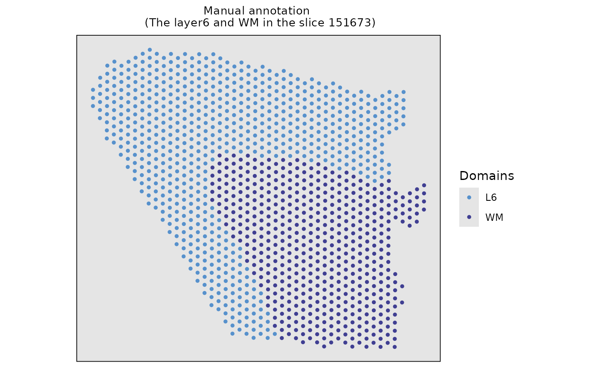
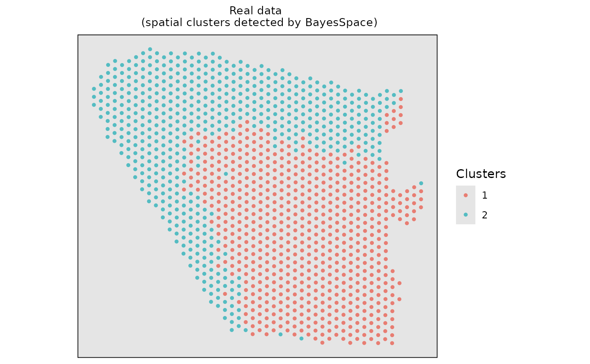
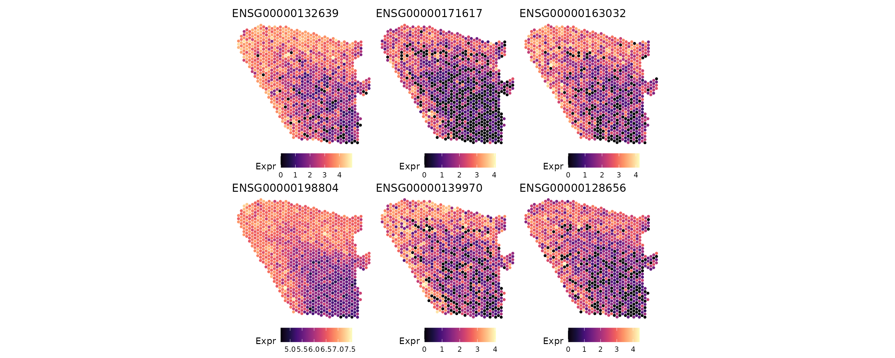

# Perform ClusterDE on a two-domain spatial dataset

## Download data

We selected adjacent layer 6 and WM of 151673 slice from the LIBD Human
Dorsolateral Prefrontal Cortex (DLPFC) dataset, which is downloaded in
the spatialLIBD R package. We removed the genes expressed in fewer than
20% spots to save computational time here.

``` r
# # Download the spot-level data
# spe <- spatialLIBD::fetch_data(type = "spe")
#
# # Select the Layer6 and WM domains in the slice "151673"
# sub_151673 <- spe[, spe$sample_id == "151673"]
# index <- sub_151673$spatialLIBD == "L6" | sub_151673$spatialLIBD == "WM"
# index[which(is.na(index))] <- "NAN"
# sub_151673 <- sub_151673[, index == "TRUE"]
# print(sub_151673)
#
# # Delete the genes that express rate less than 20%
# data <- sub_151673@assays@data$counts
# zero_expre_rate <- apply(data, 1, function(x) {
#   zero_true <- x == 0
#   zero_num <- length(which(zero_true == TRUE)) / dim(data)[2]
#   return(zero_num)
# })
# zero_expre_gene_idx <- which(zero_expre_rate < 0.8)
# sub_151673 <- sub_151673[zero_expre_gene_idx,]
# cat(paste0("The size of data: ", dim(sub_151673)[1], "*", dim(sub_151673)[2], sep = ""))
#
# # Construct the SingleCellExperiment object
# dlpfc_twodomain <- SingleCellExperiment::SingleCellExperiment(list(counts = sub_151673@assays@data$counts))
# # Add colData information of singlecellexperiment
# dlpfc_twodomain$spatial1 <- sub_151673@int_colData@listData$spatialCoords[, 2]
# dlpfc_twodomain$spatial2 <- sub_151673@int_colData@listData$spatialCoords[, 1]
# dlpfc_twodomain$cell_type <- sub_151673@colData$spatialLIBD
# SingleCellExperiment::logcounts(dlpfc_twodomain) <- log1p(SingleCellExperiment::counts(dlpfc_twodomain))
# dlpfc_twodomain <- Seurat::as.Seurat(dlpfc_twodomain)
data(dlpfc_twodomain, package = "ClusterDE")
```

Visualize the real data with two domains (L6 and WM).

``` r
# Visualize the real spatial domains
domains <- data.frame(Xaxis = dlpfc_twodomain$spatial1, Yaxis = dlpfc_twodomain$spatial2, Domains = dlpfc_twodomain$cell_type)
#> Loading required package: SeuratObject
#> Loading required package: sp
#> 
#> Attaching package: 'SeuratObject'
#> The following objects are masked from 'package:base':
#> 
#>     intersect, t
ggplot2::ggplot(domains, ggplot2::aes(x = Xaxis, y = Yaxis, col = Domains)) +
  ggplot2::geom_point(size = 1.0) +
  ggplot2::coord_equal() +
  ggplot2::ggtitle("Manual annotation \n (The layer6 and WM in the slice 151673)") +
  ggplot2::theme(
    plot.title = ggplot2::element_text(size = 10, hjust = 0.5),
    panel.grid = ggplot2::element_blank(),
    panel.background = ggplot2::element_rect(fill = "gray90"),
    panel.border = ggplot2::element_rect(color = "black", fill = NA, linewidth = 0.6),
    axis.title.x = ggplot2::element_blank(),
    axis.title.y = ggplot2::element_blank(),
    axis.ticks.x = ggplot2::element_blank(),
    axis.ticks.y = ggplot2::element_blank(),
    axis.text.x = ggplot2::element_blank(),
    axis.text.y = ggplot2::element_blank()
  ) +
  ggplot2::scale_color_manual(values = c("#5791cc", "#403f92"))
```



## Run the BayesSpace + Seurat pipeline

Firstly, we employed the BayesSpace for spatial clustering. Please note
that ClusterDE is designed for 1 vs 1 comparison; therefore, we obtain
two spatial clusters for illustration purpose.

``` r
# Construct the input of BayesSpace based on real dataset
# The input of BayesSpace is sce object
dlpfc_cluster <- SingleCellExperiment::SingleCellExperiment(
  list(counts = Seurat::GetAssayData(dlpfc_twodomain, layer = "counts"))
)
#> Warning: replacing previous import 'S4Arrays::makeNindexFromArrayViewport' by
#> 'DelayedArray::makeNindexFromArrayViewport' when loading 'SummarizedExperiment'
# Add colData information of singlecellexperiment
dlpfc_cluster$row <- dlpfc_twodomain$spatial1
dlpfc_cluster$col <- dlpfc_twodomain$spatial2

# Log-normalize the count data
set.seed(123)
dlpfc_cluster <- BayesSpace::spatialPreprocess(dlpfc_cluster, platform = "ST", n.PCs = 7, log.normalize = T)
# Clustering with BayesSpace
dlpfc_cluster <- BayesSpace::spatialCluster(
  dlpfc_cluster,
  q = 2,
  platform = "ST",
  d = 7,
  init.method = "mclust",
  model = "t",
  gamma = 2,
  nrep = 1000,
  burn.in = 100,
  save.chain = T
)
#> Neighbors were identified for 0 out of 1205 spots.
#> Fitting model...
#> You created a large dataset with compression and chunking.
#> The chunk size is equal to the dataset dimensions.
#> If you want to read subsets of the dataset, you should testsmaller chunk sizes to improve read times.
#> You created a large dataset with compression and chunking.
#> The chunk size is equal to the dataset dimensions.
#> If you want to read subsets of the dataset, you should testsmaller chunk sizes to improve read times.
#> Calculating labels using iterations 100 through 1000.
```

Visualize the spatial clustering results based on the real data.

``` r
# Visualize the spatial cluster
clusters <- data.frame(Xaxis = dlpfc_cluster$row, Yaxis = dlpfc_cluster$col, Clusters = as.character(dlpfc_cluster$spatial.cluster))
ggplot2::ggplot(clusters, ggplot2::aes(x = Xaxis, y = Yaxis, col = Clusters)) +
  ggplot2::geom_point(size = 1.0) +
  ggplot2::coord_equal() +
  ggplot2::ggtitle("Real data \n (spatial clusters detected by BayesSpace)") +
  ggplot2::theme(
    plot.title = ggplot2::element_text(size = 10, hjust = 0.5),
    panel.grid = ggplot2::element_blank(),
    panel.background = ggplot2::element_rect(fill = "gray90"),
    panel.border = ggplot2::element_rect(color = "black", fill = NA, size = 0.6),
    axis.title.x = ggplot2::element_blank(),
    axis.title.y = ggplot2::element_blank(),
    axis.ticks.x = ggplot2::element_blank(),
    axis.ticks.y = ggplot2::element_blank(),
    axis.text.x = ggplot2::element_blank(),
    axis.text.y = ggplot2::element_blank()
  ) +
  ggplot2::scale_color_manual(values = c("#e87d72", "#54bcc2"))
#> Warning: The `size` argument of `element_rect()` is deprecated as of ggplot2 3.4.0.
#> ℹ Please use the `linewidth` argument instead.
#> This warning is displayed once every 8 hours.
#> Call `lifecycle::last_lifecycle_warnings()` to see where this warning was
#> generated.
```



Then, we used the common DE method (Wilcoxon Rank Sum Test) to identify
domain marker genes between the two spatial clusters.

``` r
# Identify domain marker genes in the real dataset based on the BayesSpace clustering result, follow Seurat tutorial
dlpfc_twodomain <- Seurat::as.Seurat(dlpfc_cluster)
#> Warning: Keys should be one or more alphanumeric characters followed by an
#> underscore, setting key from PC to PC_
Seurat::Idents(dlpfc_twodomain) <- "spatial.cluster"
original_markers <- Seurat::FindMarkers(
  object = dlpfc_twodomain,
  ident.1 = 1,
  ident.2 = 2,
  test.use = "wilcox",
  logfc.threshold = 0,
  min.pct = 0,
  min.cells.feature = 1,
  min.cells.group = 1
)
head(original_markers)
#>                         p_val avg_log2FC pct.1 pct.2     p_val_adj
#> ENSG00000197971 1.620014e-188   3.071046 1.000 0.995 4.537659e-185
#> ENSG00000123560 8.266927e-180   3.262644 1.000 0.967 2.315566e-176
#> ENSG00000131095 1.904118e-172   2.949736 0.998 0.850 5.333433e-169
#> ENSG00000109846 1.878857e-167   3.166675 0.995 0.790 5.262680e-164
#> ENSG00000173786 2.472031e-165   3.081083 0.995 0.725 6.924158e-162
#> ENSG00000168314 5.661648e-150   3.056843 0.971 0.504 1.585827e-146
```

## Find DEGs using ClusterDE

We can use `findMarkers()` from ClusterDE with `spatial` specified as
name of X and Y coordinates in the data meta columns. Here in the
example, coordinates are stored in `row` and `col`.

``` r
res <- ClusterDE::findMarkers(dlpfc_twodomain, ident.1 = 1, ident.2 = 2, spatial = c("row", "col"))
#> 100% of genes are used in correlation modelling.
#> 0/1: Neighbors were identified for 0 out of 1205 spots.
#> 0/1: Fitting model...
#> 0/1: You created a large dataset with compression and chunking.
#> The chunk size is equal to the dataset dimensions.
#> If you want to read subsets of the dataset, you should testsmaller chunk sizes to improve read times.
#> 0/1: You created a large dataset with compression and chunking.
#> The chunk size is equal to the dataset dimensions.
#> If you want to read subsets of the dataset, you should testsmaller chunk sizes to improve read times.
#> 0/1: Calculating labels using iterations 100 through 1000.
#> 0/1: Normalizing layer: counts
head(res)
#> # A tibble: 6 × 3
#>   gene               cs record
#>   <chr>           <dbl>  <dbl>
#> 1 ENSG00000131095  82.1      1
#> 2 ENSG00000197971  71.5      1
#> 3 ENSG00000168314  56.3      1
#> 4 ENSG00000132639  53.9      1
#> 5 ENSG00000171617  47.9      1
#> 6 ENSG00000163032  46.2      1
```

## Visualize top marker genes

We visualize the top DE genes from ClusterDE. As expected, the top genes
detected by ClusterDE exhibit clear spatial expression patterns.

``` r
top_genes_clusterde <- res$gene[1:6]
expr <- Seurat::GetAssayData(dlpfc_twodomain, layer = "data")[top_genes_clusterde, , drop = F]
x_coord <- dlpfc_twodomain@meta.data$row
y_coord <- dlpfc_twodomain@meta.data$col

plots <- lapply(top_genes_clusterde, function(gene) {
  df <- data.frame(
    X = x_coord,
    Y = y_coord,
    Expr = as.numeric(expr[gene,])
  )
  ggplot2::ggplot(df, ggplot2::aes(x = X, y = Y, color = Expr)) +
    ggplot2::geom_point(size = 1) +
    ggplot2::scale_colour_gradientn(colors = viridis::viridis_pal(option = "magma")(10)) +
    ggplot2::coord_fixed() +
    ggplot2::ggtitle(gene) +
    ggplot2::theme_void() +
    ggplot2::theme(legend.position = "bottom")
})

patchwork::wrap_plots(plots, nrow = 2)
```



## Session information

``` r
sessionInfo()
#> R version 4.3.1 (2023-06-16)
#> Platform: x86_64-pc-linux-gnu (64-bit)
#> Running under: Red Hat Enterprise Linux 8.10 (Ootpa)
#> 
#> Matrix products: default
#> BLAS:   /sw/pkgs/arc/stacks/gcc/10.3.0/R/4.3.1/lib64/R/lib/libRblas.so 
#> LAPACK: /sw/pkgs/arc/stacks/gcc/10.3.0/R/4.3.1/lib64/R/lib/libRlapack.so;  LAPACK version 3.11.0
#> 
#> locale:
#>  [1] LC_CTYPE=en_US.UTF-8       LC_NUMERIC=C              
#>  [3] LC_TIME=en_US.UTF-8        LC_COLLATE=en_US.UTF-8    
#>  [5] LC_MONETARY=en_US.UTF-8    LC_MESSAGES=en_US.UTF-8   
#>  [7] LC_PAPER=en_US.UTF-8       LC_NAME=C                 
#>  [9] LC_ADDRESS=C               LC_TELEPHONE=C            
#> [11] LC_MEASUREMENT=en_US.UTF-8 LC_IDENTIFICATION=C       
#> 
#> time zone: America/Detroit
#> tzcode source: system (glibc)
#> 
#> attached base packages:
#> [1] stats     graphics  grDevices utils     datasets  methods   base     
#> 
#> other attached packages:
#> [1] SeuratObject_5.2.0 sp_2.2-0           BiocStyle_2.30.0  
#> 
#> loaded via a namespace (and not attached):
#>   [1] fs_1.6.6                    matrixStats_1.5.0          
#>   [3] spatstat.sparse_3.1-0       bitops_1.0-9               
#>   [5] httr_1.4.7                  RColorBrewer_1.1-3         
#>   [7] backports_1.5.0             tools_4.3.1                
#>   [9] sctransform_0.4.2           utf8_1.2.6                 
#>  [11] R6_2.6.1                    DirichletReg_0.7-2         
#>  [13] lazyeval_0.2.2              uwot_0.2.3                 
#>  [15] rhdf5filters_1.14.1         withr_3.0.2                
#>  [17] ClusterDE_0.99.3            gridExtra_2.3              
#>  [19] progressr_0.17.0            cli_3.6.5                  
#>  [21] Biobase_2.62.0              textshaping_1.0.4          
#>  [23] spatstat.explore_3.5-3      fastDummies_1.7.5          
#>  [25] sandwich_3.1-1              labeling_0.4.3             
#>  [27] sass_0.4.10                 Seurat_5.3.1               
#>  [29] S7_0.2.0                    spatstat.data_3.1-9        
#>  [31] ggridges_0.5.7              pbapply_1.7-4              
#>  [33] pkgdown_2.2.0               systemfonts_1.3.1          
#>  [35] scater_1.30.1               parallelly_1.45.1          
#>  [37] limma_3.58.1                RSQLite_2.4.5              
#>  [39] generics_0.1.4              ica_1.0-3                  
#>  [41] spatstat.random_3.4-2       dplyr_1.1.4                
#>  [43] Matrix_1.6-5                ggbeeswarm_0.7.3           
#>  [45] S4Vectors_0.40.2            abind_1.4-8                
#>  [47] lifecycle_1.0.4             yaml_2.3.10                
#>  [49] edgeR_4.0.16                SummarizedExperiment_1.32.0
#>  [51] rhdf5_2.46.1                SparseArray_1.2.4          
#>  [53] BiocFileCache_2.10.2        Rtsne_0.17                 
#>  [55] grid_4.3.1                  blob_1.2.4                 
#>  [57] promises_1.4.0              dqrng_0.4.1                
#>  [59] crayon_1.5.3                miniUI_0.1.2               
#>  [61] lattice_0.21-8              beachmat_2.18.1            
#>  [63] cowplot_1.2.0               kde1d_1.1.1                
#>  [65] pillar_1.11.1               knitr_1.50                 
#>  [67] metapod_1.10.1              GenomicRanges_1.54.1       
#>  [69] randtoolbox_2.0.5           xgboost_3.1.2.1            
#>  [71] future.apply_1.20.0         codetools_0.2-19           
#>  [73] glue_1.8.0                  spatstat.univar_3.1-4      
#>  [75] data.table_1.17.8           vctrs_0.6.5                
#>  [77] png_0.1-8                   spam_2.11-1                
#>  [79] gtable_0.3.6                assertthat_0.2.1           
#>  [81] cachem_1.1.0                xfun_0.53                  
#>  [83] S4Arrays_1.2.1              mime_0.13                  
#>  [85] coop_0.6-3                  rngWELL_0.10-10            
#>  [87] coda_0.19-4.1               survival_3.5-5             
#>  [89] SingleCellExperiment_1.24.0 maxLik_1.5-2.1             
#>  [91] statmod_1.5.1               bluster_1.12.0             
#>  [93] BayesSpace_1.12.0           fitdistrplus_1.2-4         
#>  [95] ROCR_1.0-11                 bettermc_1.2.2.9000        
#>  [97] nlme_3.1-162                bit64_4.6.0-1              
#>  [99] filelock_1.0.3              RcppAnnoy_0.0.22           
#> [101] GenomeInfoDb_1.38.8         bslib_0.9.0                
#> [103] irlba_2.3.5.1               vipor_0.4.7                
#> [105] KernSmooth_2.23-21          otel_0.2.0                 
#> [107] BiocGenerics_0.48.1         DBI_1.2.3                  
#> [109] tidyselect_1.2.1            bit_4.6.0                  
#> [111] compiler_4.3.1              curl_7.0.0                 
#> [113] BiocNeighbors_1.20.2        desc_1.4.3                 
#> [115] DelayedArray_0.28.0         plotly_4.11.0              
#> [117] bookdown_0.45               checkmate_2.3.3            
#> [119] scales_1.4.0                lmtest_0.9-40              
#> [121] mvnfast_0.2.8               rvinecopulib_0.7.3.1.0     
#> [123] stringr_1.5.2               digest_0.6.37              
#> [125] goftest_1.2-3               presto_1.0.0               
#> [127] spatstat.utils_3.2-0        rmarkdown_2.30             
#> [129] XVector_0.42.0              htmltools_0.5.8.1          
#> [131] pkgconfig_2.0.3             sparseMatrixStats_1.14.0   
#> [133] MatrixGenerics_1.14.0       dbplyr_2.5.1               
#> [135] fastmap_1.2.0               rlang_1.1.6                
#> [137] htmlwidgets_1.6.4           shiny_1.11.1               
#> [139] DelayedMatrixStats_1.24.0   farver_2.1.2               
#> [141] jquerylib_0.1.4             zoo_1.8-14                 
#> [143] jsonlite_2.0.0              BiocParallel_1.36.0        
#> [145] mclust_6.1.1                BiocSingular_1.18.0        
#> [147] RCurl_1.98-1.17             magrittr_2.0.4             
#> [149] Formula_1.2-5               scuttle_1.12.0             
#> [151] GenomeInfoDbData_1.2.11     dotCall64_1.2              
#> [153] patchwork_1.3.2             Rhdf5lib_1.24.2            
#> [155] Rcpp_1.1.0                  viridis_0.6.5              
#> [157] reticulate_1.44.0           stringi_1.8.7              
#> [159] zlibbioc_1.48.2             MASS_7.3-60                
#> [161] gamlss.dist_6.1-1           plyr_1.8.9                 
#> [163] parallel_4.3.1              listenv_0.9.1              
#> [165] ggrepel_0.9.6               deldir_2.0-4               
#> [167] splines_4.3.1               tensor_1.5.1               
#> [169] locfit_1.5-9.12             igraph_2.2.1               
#> [171] spatstat.geom_3.6-0         RcppHNSW_0.6.0             
#> [173] reshape2_1.4.4              stats4_4.3.1               
#> [175] ScaledMatrix_1.10.0         evaluate_1.0.5             
#> [177] scran_1.30.2                BiocManager_1.30.26        
#> [179] httpuv_1.6.16               miscTools_0.6-28           
#> [181] RANN_2.6.2                  tidyr_1.3.1                
#> [183] purrr_1.1.0                 polyclip_1.10-7            
#> [185] future_1.67.0               scattermore_1.2            
#> [187] ggplot2_4.0.0               rsvd_1.0.5                 
#> [189] xtable_1.8-4                RSpectra_0.16-2            
#> [191] later_1.4.4                 viridisLite_0.4.2          
#> [193] ragg_1.5.0                  tibble_3.3.0               
#> [195] memoise_2.0.1               beeswarm_0.4.0             
#> [197] IRanges_2.36.0              cluster_2.1.4              
#> [199] globals_0.18.0
```
